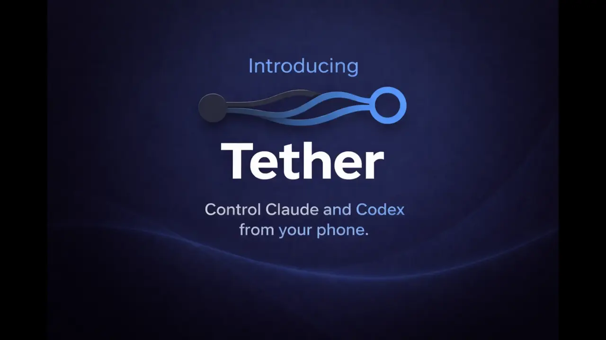

#  Tether

[](https://github.com/XIThing/tether/actions/workflows/ci.yml)
[](LICENSE)
[]()

Control your AI agents from your phone when you're away from your desk.



You start a coding agent, walk away for lunch, and come back to find it stuck waiting for input for an hour. Tether fixes that. Get notified when your agent needs you, respond from anywhere.

## Features

- **Local-first** — Runs on your machine, your data stays yours
- **Multi-agent** — Supports Claude and Codex, more to come (let me know which ones!)
- **Web UI** — Monitor sessions from your phone or desktop (mobile app on the way)
- **No API keys required** — Uses Claude / Codex local OAuth by default

## Quick Start

**AI agent:**

Paste this into Claude Code, Codex, or your preferred AI coding assistant:

> Clone and set up Tether from github.com/XIThing/tether following AGENTS.md

**Manual setup:**

```bash
git clone https://github.com/XIThing/tether.git
cd tether
make install
make start
open http://localhost:8787
```

Requirements: Python 3.10+, Node.js 20+

## Access from Phone

1. Find your computer's IP address
2. Open firewall port 8787 (see below)
3. Open `http://<your-ip>:8787` on your phone

### Firewall Commands

**Linux (firewalld):**
```bash
sudo firewall-cmd --add-port=8787/tcp --permanent && sudo firewall-cmd --reload
```

**Linux (ufw):**
```bash
sudo ufw allow 8787/tcp
```

**macOS:**
System Settings > Network > Firewall > Options > Allow incoming connections

## Configuration

Copy `.env.example` to `.env` to customize settings.

### Adapters

Set `TETHER_AGENT_ADAPTER` in `.env`:

| Adapter | Description |
|---------|-------------|
| `claude_local` | Claude via local OAuth (default, no API key) |
| `claude_api` | Claude via API key (set `ANTHROPIC_API_KEY`) |
| `claude_auto` | Auto-detect (prefer OAuth, fallback to API key) |
| `codex_sdk_sidecar` | Codex via sidecar (use `make start-codex`) |
| `codex_cli` | Legacy Codex CLI runner |

### Authentication

By default, no auth is required. To require a token:
```bash
TETHER_AGENT_TOKEN=your-secret-token make start
```

## Commands

### Native Mode (Recommended)
```bash
make install      # Install Python and Node dependencies (once)
make start        # Start agent with UI (localhost:8787)
make start-codex  # Start agent + Codex sidecar
make stop         # Stop sidecar container
make test         # Run tests
```

### Development
```bash
make dev-ui       # Run UI with hot reload (agent runs separately)
make dev          # Run sidecar + telegram in Docker for dev
make dev-stop     # Stop dev containers
```

### Docker Mode (Legacy)
For users who prefer Docker. Note: requires volume mounts for file access.
```bash
make docker-start        # Start agent in Docker
make docker-start-codex  # Start agent + sidecar in Docker
make docker-stop         # Stop all containers
make docker-logs         # View logs
make docker-build        # Rebuild images
```

## FAQ

**What does Tether add on top of Claude Code or Codex?**

Claude Code and Codex require you to be at your PC. Tether provides a mobile UI and API to see progress and give instructions, even when you're away from your desk.

**Is my code sent to the cloud?**

Tether runs entirely on your machine. Your code stays local and is never sent to Tether servers (there are no Tether servers). The only external communication is between you and your chosen AI provider (Anthropic or OpenAI).

**Do I need an API key to use Tether?**

Not necessarily. Tether integrates with the Claude and Codex SDKs, which both support local authentication. By default, Tether uses Claude's local OAuth, so no API key is needed. You can optionally use API keys if you prefer.

**Why not just SSH into my machine?**

SSH is finnicky to set up for mobile access and awkward to use on a phone. When you're away from your desk, you don't need a full terminal. You need to quickly see what's happening and respond. Tether gives you just that: a clean mobile UI built for checking in and giving instructions.

**Can I access Tether from outside my home network?**

Currently, Tether works on your local network. For remote access today, you can use a VPN like Tailscale or WireGuard. We're building a hosted relay service that will let you securely access your agent from anywhere without VPN setup. See [gettether.dev](https://gettether.dev) for updates.

## Current Status

**What works:**
- PWA-ready mobile-first Web UI (works on Desktop too)
- Attach to existing Claude and Codex sessions (and start new sessions)
- Monitor live output from your phone or desktop
- Send input and instructions to the agent
- Integrated Git diff viewer in the web UI
- Shortcuts in the web UI for common actions to reduce typing effort

**Work in progress:**
- Local network only (no relay yet)
- Claude runner is more stable than Codex
- No approvals handling yet (agents run with auto-approve)
- Web UI only (no native mobile app)

## Roadmap

**Next up:**
- Approvals integration
- WebSockets (replacing SSE)
- Quick actions management in the Web UI
- Codex runner improvements - Try to phase out sidecar approach

**Later:**
- More agent integrations
- Hosted relay service (access from anywhere without VPN)
- Native mobile app

See [gettether.dev](https://gettether.dev) for updates.

## Contributing

See [CONTRIBUTING.md](CONTRIBUTING.md) for development setup.

Questions or ideas? Start a conversation in [GitHub Discussions](https://github.com/XIThing/tether/discussions).

## License

Apache 2.0. See [LICENSE](LICENSE) for details.

---

[Website](https://gettether.dev) · Built by [XIThing](https://xithing.io)
